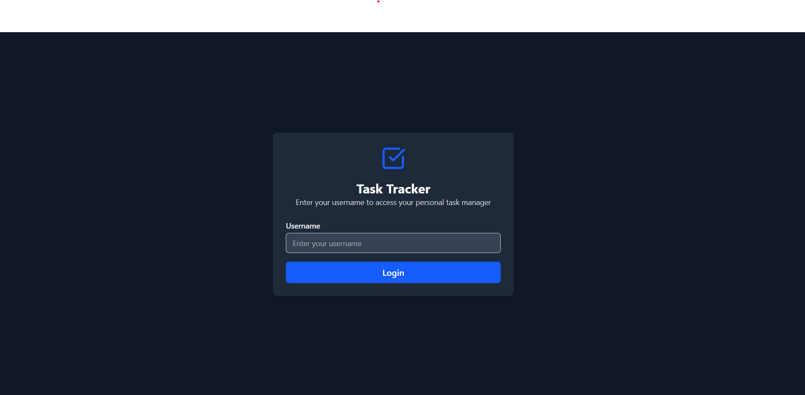
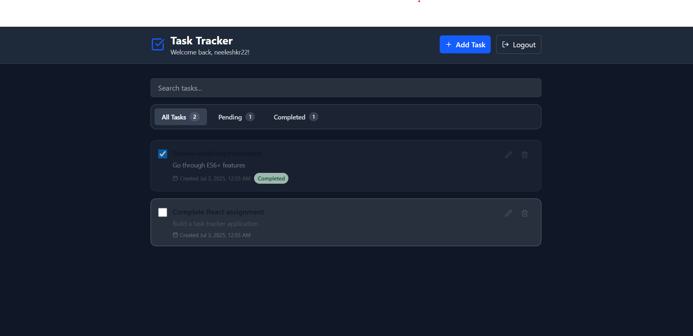

# ✅ Personal Task Tracker

A sleek and responsive task tracker built with **React.js**, featuring localStorage persistence, glassmorphism UI, dark mode, task filtering, and real-time search.

## 📖 Description

The **Personal Task Tracker** allows you to manage your to-do tasks efficiently. With features like task completion, filtering, editing, deletion, and a modern glass UI, it offers a pleasant user experience in both light and dark themes. Tasks persist using localStorage so your data stays intact across sessions.

---

## 🚀 Features

- ✅ Add, Edit, Delete Tasks
- 🌓 Dark Mode support
- 🔍 Real-time Task Search
- 🧠 Task Filters (All, Pending, Completed)
- 💾 Persistent localStorage support
- ✨ Modern UI with Glassmorphism effect
- ⏳ Timestamps for task creation
- 🔁 Responsive design across devices

---

## 🛠️ Setup Instructions

1. **Clone the repository**
   ```bash
   git clone https://github.com/neeleshkr22/Task-tracker.git
   cd Task-tracker
   ```

2. **Install dependencies**
   ```bash
   npm install
   ```

3. **Run the development server**
   ```bash
   npm start
   ```

4. **Visit**
   ```
   http://localhost:3000
   ```

---

## 🧰 Technologies Used

- ⚛️ React.js (with Hooks)
- 🎨 Tailwind CSS
- 🌗 Dark Mode via Tailwind
- 💾 localStorage
- 📦 Vite (React template)
- 💡 Lucide Icons

---

## 🔗 Live Demo

[🔗 Click here to view live](https://your-deployed-link.vercel.app)

---

## 🖼️ Screenshots

### 🧩 Dashboard View


### Login


###Task


---


